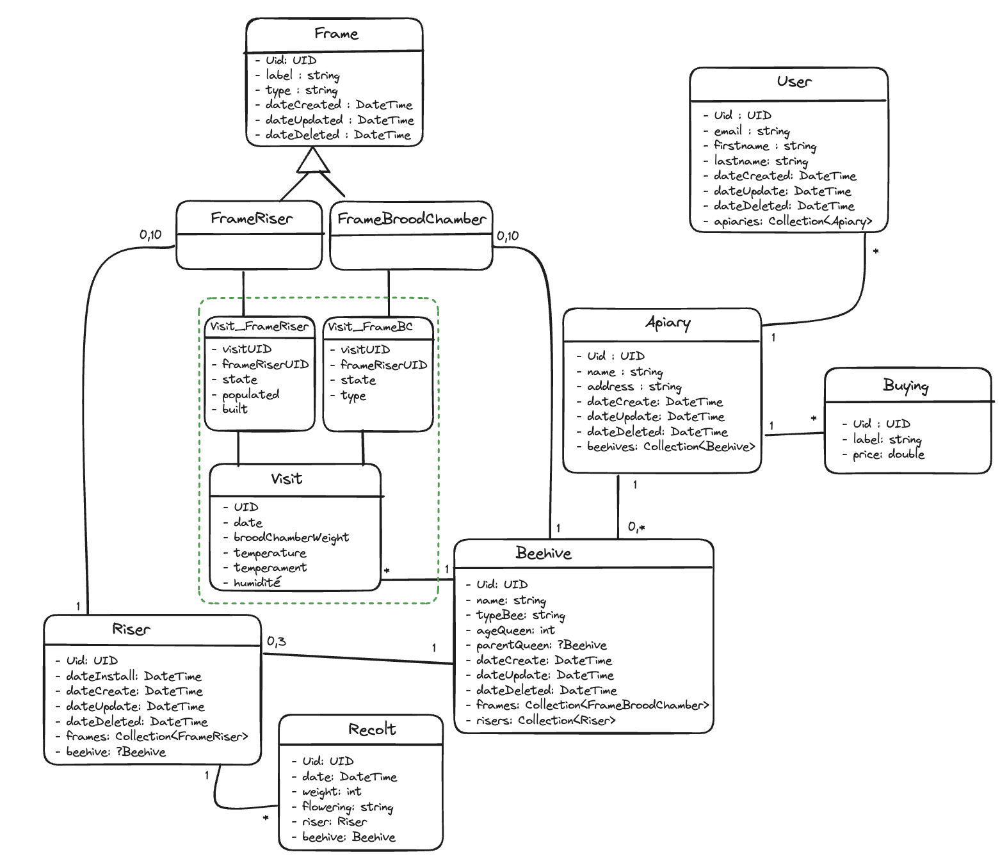

HIVE FIVE
======

HIVE FIVE app is composed of:

- A [front application](front/README.md), as an IHM developed with React
- A [back application](./back/README.md), as a web API developed with Symfony

## Setup

The project can run locally using Node.js and Symfony CLI + Docker.

## URLs

- Application back : http://127.0.0.1:63280
- Application front : http://127.0.0.1:63281
- Mailer : http://127.0.0.1:62521
- GraphiQL : http://127.0.0.1:63280/graphiql
- Symfony profiler : http://127.0.0.1:63280/_profiler

## Fixtures

user : user@example.com
admin : admin@example.com

### Model

## Deploy

- [Release & deploy process](./docs/release+deploy.md)

## Going further

Also have a look at:

- [The front app README.md](front/README.md)
- [The back app README.md](./back/README.md)
