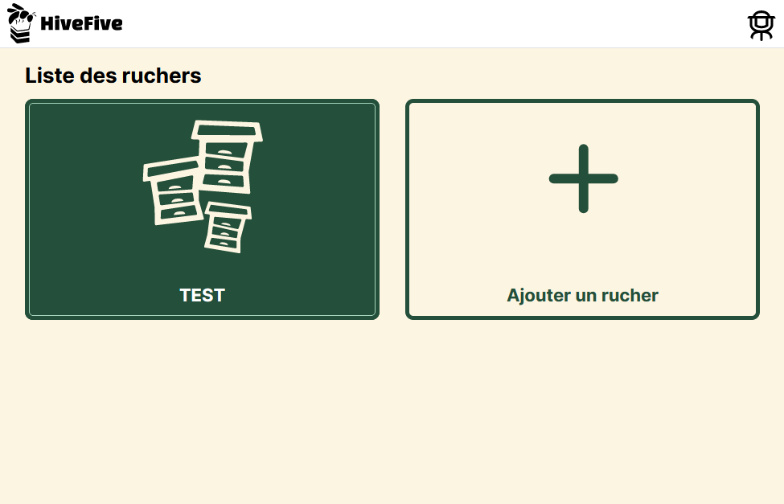

<h2 align="center">
    <a href="https://hivefive.online" target="blank_">
        
    </a>
    <br>
    HiveFive: a beekeeper's companion
</h2>

[![Symfony version][symfony_version_img]][symfo_url]
[![React version][react_version_img]][react_url]
[![Wiki][repo_wiki_img]][repo_wiki_url]
[![License][repo_license_img]][repo_license_url]

Manage your **beekeeping** activities with **HiveFive**. Collect and analyze data about your hives, apiaries, and more. Get **insights** about your apiaries and hives, and share your data with other beekeepers.

- [🐝 Features](#-features)
  - [📊 Data collection](#-data-collection)
  - [📈 Data analysis](#-data-analysis)
  - [📱 Mobile-friendly](#-mobile-friendly)
- [📁 Root project structure](#-root-project-structure)
- [⚡️ Quick start](#️-quick-start)
  - [🐳 Docker-way to quick start](#-docker-way-to-quick-start)
- [📚 Documentation](#-documentation)
- [⚙️ Settings \& Commands](#️-settings--commands)
- [🤝 Build with us!](#-build-with-us)
- [⚠️ License](#️-license)

## 🐝 Features

### 📊 Data collection

- **HiveFive** allows you to collect data about your hives and apiaries. You can add as many hives and apiaries as you want, and add data about them. You can also add **inspections** to your hives, and add data about them.

[](https://hivefive.online)

### 📈 Data analysis

(Coming soon)

### 📱 Mobile-friendly

**HiveFive** is mobile-friendly. You can use it on your phone, tablet, or computer. The interface is responsive and adapts to your device.

(To add...)

## 📁 Root project structure

```bash
├── .github/            # GitHub-specific files (CI/CD, etc.)
├── .husky/             # Husky Git hooks (pre-commit, etc.)
├── back/               # Backend (Symfony, GraphQL)
├── docs/               # Documentation files (README, etc.)
├── front/              # Frontend (React, TypeScript)
├── make/               # Mk helper files (Makefile, etc.)
|── LICENSE             # Project license
|── Makefile            # General Makefile for project
|── README.md           # Project README
|── docker-compose.yml  # Docker Compose configuration file
|── ...                 # Other project files
```

## ⚡️ Quick start

> [!IMPORTANT]  
> Make sure that you have `PostgreSQL` and `PHP 8.1+` installed on your system.

1. Clone the repository and go to the project folder:

```bash
git clone git@github.com:Hive-Five-project/hive-five.git
cd hive-five
```

2. Install dependencies for the backend and frontend:

```bash
make install
```

3. Start the project:

```bash
make serve
```

That's all you need to know to start! 🎉

### 🐳 Docker-way to quick start

If you don't want to install dependencies to your system, you feel free 
to use our `docker-compose.yml` file to run the project in Docker

> [!IMPORTANT]
> You need to have `docker` installed on your system.

```bash
docker-compose up
```

> [!TIP]
> This spins up 3 main services: `react`, `symfony`, and `database`:
> - `react` (frontend) is available at `http://127.0.0.1:63281`
> - `symfony` (backend) is available at `http://127.0.0.1:63280|63290`
>
> `symfony` also provides multiples endpoints:
> - `http://127.0.0.1:62551` - Maildev (SMTP server)
> - `http://127.0.0.1:63280/graphiql` - GraphiQL (GraphQL IDE)
> - `http://127.0.0.1:63280/_profiler` - Symfony Profiler

And you're ready to go! 🚀

## 📚 Documentation

The best way to better explore all the features of the **HiveFive** 
is to read the project [Wiki][repo_wiki_url] and take part in [Issues][repo_issues_url].

## ⚙️ Settings \& Commands

You'll likely want to customize the project settings for your needs. For this, both the backend and frontend have their own .env files. You can find them in the `back/.env` and `front/.env` files.

Also, you can use the `Makefile` to run the most common commands. Here are some of them:
```bash	
make install          # Install dependencies for the backend and frontend

make serve            # Start the project

# in /back
make test             # Run tests for the backend
make lint            # Run linters for the backend
make db.fixtures      # Load fixtures to the database
make db.reset         # Reset the database
...

# in /front
make test             # Run tests for the frontend
make lint            # Run linters for the frontend
...
```

## 🤝 Build with us!

And now, I invite you to participate in this project! Let's work **together** to
create the **most useful** and **simple** application for beekeepers.

To get started, please read the [Wiki][repo_wiki_url] and take part in the project:
- [Issues][repo_issues_url]: ask questions and submit your features.
- [Pull requests][repo_pull_request_url]: send your improvements to the current.

Together, we can make this project **better** every day! 😘

## ⚠️ License

[`HiveFive`][repo_url] is free and open-source software licensed under 
the [Apache 2.0 License][repo_license_url].

<!-- App V. -->

[symfony_version_img]: https://img.shields.io/badge/Symfony-6.3.5-success?style=for-the-badge&logo=symfony
[react_version_img]: https://img.shields.io/badge/React-18.2.0-success?style=for-the-badge&logo=react
[symfo_url]: https://symfony.com/
[react_url]: https://reactjs.org/


<!-- Repository -->

[repo_url]: https://github.com/Hive-Five-project/hive-five
[repo_license_url]: https://github.com/Hive-Five-project/hive-five/blob/main/LICENSE
[repo_license_img]: https://img.shields.io/badge/license-Apache_2.0-red?style=for-the-badge&logo=none
[repo_issues_url]: https://github.com/Hive-Five-project/hive-five/issues
[repo_pull_request_url]: https://github.com/Hive-Five-project/hive-five/pulls
[repo_discussions_url]: https://github.com/Hive-Five-project/hive-five/discussions
[repo_releases_url]: https://github.com/Hive-Five-project/hive-five/releases
[repo_wiki_url]: https://github.com/Hive-Five-project/hive-five/tree/main/docs
[repo_wiki_img]: https://img.shields.io/badge/docs-wiki_page-blue?style=for-the-badge&logo=none
