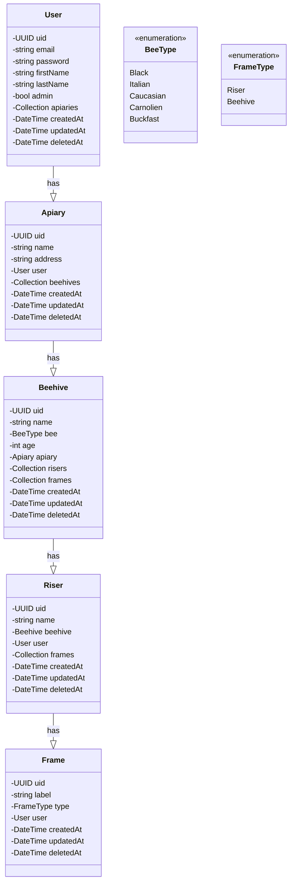

HIVE FIVE Back
=========

HIVE FIVE back is a Symfony app containing:

- a database models & connection PostgreSQL + doctrine
- a GraphQL API for the React front client.

## Requirements

- Symfony CLI
- Docker

## Model


## Setup

When using Symfony CLI locally, you're done!

## How to connect with DBeaver to database


## List all commands for Makefile

```shell
make
make help
```
## Installation

```shell
make install
```

## Linting

```shell
make lint
```

## Tests

Read for debug and understanding : [How to do testing here](./docs/tests.md)

```shell
make test
```
### How to filter for tests :
```shell
symfony php bin/phpunit --filter='test-name'
```
### How to update snapshot
```shell
UP=1 symfony php bin/phpunit --filter='test-name'
```
>/!\ Carefull with updates snapshots before commit push. Look at diff.

## App specific commands

## Database

### Update

Force update your database schema to match your model:

```shell
make db.update
```

### Fixtures

```shell
make db.fixtures
```

### Reset

Drop and recreate the database:

```shell
make db.reset
```
## Application

### Serve symfony
```shell
make serve
```

### Stop symfony
```shell
make stop
```

## Going further

- [How to authenticate as a User for GraphiQL console](./docs/graphiql_auth.md)

## Refs

- [GraphiQL (QraphQL Web console)](http://[URL]/graphiql)

## Useful tools

- [PhpStorm GraphQL Extension](https://plugins.jetbrains.com/plugin/8097-graphql): provides GraphQL support in PhpStorm
  as well as syntax highlight, schema discovery and autocompletion.
- [PhpStorm UUID/ULID Generator Extension](https://plugins.jetbrains.com/plugin/8320-uuid-generator): provides UUID/ULID generation in PhpStorm.

---  
⬆︎ [**Back to README.md**](../README.md)  
