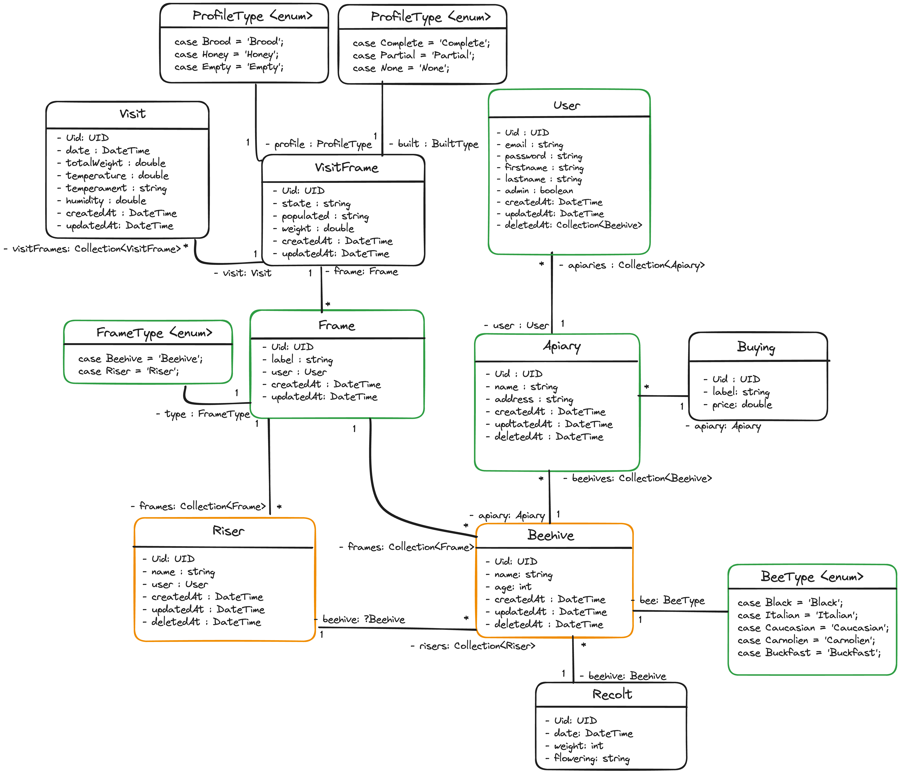

# Project Architecture

**HiveFive** is built in a mono-repository architecture. This means that the project is a single repository that contains all the code for the application. It contains:

- **back**: The backend is built using `Symfony` and `GraphQL`.
- **front**: The frontend is built using `React` and `Mantine`.

We use `Docker` to containerize the application. The `docker-compose.yml` file contains the configuration for the `React`, `Symfony`, and `PostgreSQL` services.

## Architecture Diagram

## Backend Objects relationships

